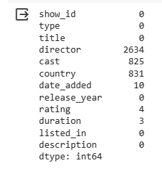
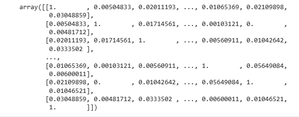

# Movie Recommendation System

Copyright (c) 2024, SMART &PRO - Juan García

All rights reserved.

The code and associated documentation files (the "Software") are the intellectual property of SMART &PRO and are protected under applicable copyright laws. This Software is solely for educational and research purposes. Any use of the Software for commercial purposes, including but not limited to the reproduction, distribution, display, or performance of the Software, or the use of the Software to create derivative works, is strictly prohibited without the prior written consent of SMART &PRO (Juan García).

By downloading, cloning, or using the Software, you agree to abide by the terms of this notice. Unauthorized use, modification, or sharing of the Software is a violation of copyright laws and may result in legal action.

## Code module 1

The code snippet you've shared is a command line instruction used in a Python environment. Here's a breakdown of its elements:

1. **What It Is**:
    - `!pip3 install -q`: This is a command that uses `pip3`, which is a package manager for Python 3. The `!` at the beginning indicates that this command is to be run in a shell (like a command line or terminal) from within a Jupyter notebook or similar interactive environment. The `-q` flag stands for "quiet", which means the command will run with minimal output, only displaying errors and warnings.

2. **Purpose**:
    - The command is used to install several Python libraries: `numpy`, `pandas`, `matplotlib`, `plotly`, `wordcloud`, and `scikit-learn`. These libraries are widely used for data analysis, data visualization, and machine learning tasks in Python.

3. **Objective**:
    - The objective of this command is to ensure that these essential Python libraries are installed and available for use in the user's Python environment. This is typically a preparatory step before the user begins a data analysis or machine learning project.

    - **numpy**: A library for numerical computing in Python. It provides support for large, multi-dimensional arrays and matrices, along with a collection of mathematical functions to operate on these arrays.

    - **pandas**: A data manipulation and analysis library. It offers data structures like DataFrame and Series for manipulating and analyzing tabular data with ease.

    - **matplotlib**: A plotting library for creating static, animated, and interactive visualizations in Python.

    - **plotly**: Another data visualization library, known for its interactive plots that can be used in web applications.

    - **wordcloud**: A tool for creating word cloud visualizations, often used to highlight the most frequent words in a text in a visually appealing way.

    - **scikit-learn**: A machine learning library for Python. It features various classification, regression, clustering algorithms, and tools for model evaluation, data preprocessing, and model tuning.

```python
!pip3 install -q numpy pandas matplotlib plotly wordcloud scikit-learn
```

## Code Module 2

This code is a collection of import statements in Python, used to include various libraries and specific functions or classes from those libraries into the Python script or notebook where this code is executed. Here's a detailed explanation:

1. **import string**: 
    - This imports Python's built-in `string` module, which contains a collection of string constants, like ASCII characters, digits, hexadecimal digits, and others.

2. **import numpy as np**:
    - This imports the `numpy` library, a fundamental package for numerical computations in Python, and it's aliased as `np`. This aliasing means you can use `np` instead of `numpy` when calling functions from this library.

3. **import pandas as pd**:
    - Similar to the numpy import, this line imports the `pandas` library, a powerful tool for data manipulation and analysis, particularly for tabular data, and aliases it as `pd`.

4. **import matplotlib.pyplot as plt**:
    - This imports the `pyplot` module from `matplotlib`, a library used for creating static, animated, and interactive visualizations in Python. It's aliased as `plt`.

5. **import plotly.graph_objects as go**:
    - This imports the `graph_objects` module from `plotly`, a library for creating interactive and aesthetically pleasing visualizations. It's often used for making complex plots like 3D plots, and it's aliased as `go`.

6. **import plotly.express as px**:
    - This line imports the `express` module from `plotly`, which is a simpler interface for creating common types of charts and maps. It's aliased as `px`.

7. **from wordcloud import WordCloud**:
    - This imports the `WordCloud` class from the `wordcloud` library, which is used to create word cloud visualizations.

8. **import pickle**:
    - This imports the `pickle` module, which is used for serializing and deserializing Python object structures, commonly known as 'pickling' and 'unpickling'.

9. **from sklearn.feature_extraction.text import TfidfVectorizer**:
    - This line imports `TfidfVectorizer` from `sklearn.feature_extraction.text`, a part of the `scikit-learn` library. `TfidfVectorizer` is used for converting a collection of raw documents into a matrix of TF-IDF (Term Frequency-Inverse Document Frequency) features.

10. **from sklearn.metrics.pairwise import cosine_similarity**:
    - This imports the `cosine_similarity` function from `sklearn.metrics.pairwise`. This function is used to compute similarity between two or more documents or vectors based on their cosine angle.

11. **from scipy.sparse import save_npz**:
    - This imports `save_npz` from `scipy.sparse`, which is a function to save a sparse matrix to a file using `.npz` format.

12. **import warnings** and **warnings.filterwarnings('ignore')**:
    - These two lines are used to control Python's warning messages. The `import warnings` line imports the warnings module, and `warnings.filterwarnings('ignore')` suppresses all warnings. This can be useful to keep the output of the code clean, especially if you know that the warnings are not critical, but it's generally good practice to be aware of what warnings are being suppressed.

The objective of this code is to set up a Python environment with the necessary libraries and functions for tasks related to data manipulation, visualization, and text processing, particularly for applications like text analysis and machine learning.

```python
import string
import numpy as np
import pandas as pd
import matplotlib.pyplot as plt
import plotly.graph_objects as go
import plotly.express as px
from wordcloud import WordCloud
import pickle
from sklearn.feature_extraction.text import TfidfVectorizer
from sklearn.metrics.pairwise import cosine_similarity
import numpy as np
from scipy.sparse import save_npz
import warnings
warnings.filterwarnings('ignore')
```

## Code module 3

The next code is a Python command, typically used in a data analysis context. Here's an explanation following the same structure:

1. **What It Is**:
    - `df = pd.read_csv("data/movie_data.csv")`: This line of code involves reading a CSV (Comma-Separated Values) file into a DataFrame using pandas, a popular data manipulation library in Python. `pd` is a common alias for pandas, and `read_csv` is a function to read a CSV file.
    - `df.head()`: This line of code displays the first five rows of the DataFrame `df`. The `head()` method is used to quickly get a glimpse of the dataset, including column names and some of the values.

2. **Purpose**:
    - The purpose of these commands is to load and preview a dataset. This is a common first step in data analysis projects to understand the structure and content of the data.

3. **Objective**:
    - The objective of the first line (`df = pd.read_csv("data/movie_data.csv")`) is to create a pandas DataFrame called `df` by loading data from a CSV file named `movie_data.csv` located in a `data` directory. This allows the user to work with the data in Python using pandas' powerful data manipulation capabilities.
    - The objective of the second line (`df.head()`) is to quickly inspect the first few records of the DataFrame. This helps in getting an immediate sense of the data, such as the number of columns, the type of data in each column, and if there are any immediate data quality issues (like missing values). It's a simple yet effective way to start understanding the dataset.

```python
df = pd.read_csv("data/movie_data.csv")
df.head()
```


## Code module 4

`df.info()` is a method call in Python, specifically used in the context of data analysis with the pandas library. Here's a breakdown of its elements:

1. **What It Is**:
    - `df`: This typically represents a DataFrame object in pandas. DataFrames are one of the central data structures in pandas, used for storing and manipulating tabular data.
    - `.info()`: This is a method of the DataFrame object. The `info()` method is invoked on a DataFrame instance.

2. **Purpose**:
    - The primary purpose of the `info()` method is to provide a concise summary of the DataFrame. This summary includes essential details about the DataFrame's structure and contents.

3. **Objective**:
    - The objective of calling `df.info()` is to gain a quick overview of the DataFrame's data, which aids in understanding the dataset's characteristics. Specifically, the `info()` method provides the following information:
        - The number of entries in the DataFrame (rows).
        - The total number of columns.
        - A list of all columns along with their data types.
        - The number of non-null entries in each column, which is helpful for identifying missing values.
        - The amount of memory used by the DataFrame, giving an indication of its size and the computational resources it might require.
    - This method is particularly useful in the initial stages of data analysis, as it helps data analysts and scientists to quickly assess the data they are working with, plan for any data preprocessing steps (like handling missing values or converting data types), and get a general sense of the dataset's structure and size.
  
```python
df.info()
```


## Code module 5

1. **What It Is**:
    - `df.isnull().sum()`: This is a combination of methods in Python, typically used in the context of the pandas library, which is a popular data manipulation tool in Python. 
    - `df`: This represents a DataFrame in pandas. A DataFrame is a two-dimensional, size-mutable, and potentially heterogeneous tabular data structure with labeled axes (rows and columns).
    - `isnull()`: This is a method called on the DataFrame `df`. It returns a DataFrame where each cell is either `True` or `False`, depending on whether the corresponding cell in `df` is `NaN` (Not a Number) or not. In pandas, `NaN` is often used as a marker for missing or otherwise undefined values.
    - `sum()`: This method is then called on the DataFrame returned by `isnull()`. In this context, `sum()` adds up all the `True` values column-wise. Since `True` is treated as `1` and `False` as `0`, this effectively counts the number of `NaN` (null) values in each column of the original DataFrame `df`.

2. **Purpose**:
    - The primary purpose of this code is to identify and count missing values in each column of a DataFrame. This is a common task in data analysis, as handling missing data is a critical step in preparing data for analysis or machine learning models.

3. **Objective**:
    - The objective of using `df.isnull().sum()` is to quickly assess how many missing or undefined values are present in each column of the DataFrame `df`. This information is crucial for data cleaning and preprocessing. It helps in making informed decisions about how to handle missing data, such as whether to fill them with other values, drop the rows or columns with missing values, or perform some other form of imputation or adjustment.
    - This method provides a concise summary that can guide further data processing steps, ensuring the integrity and quality of the data analysis or modeling work that follows.
  
```python
df.isnull().sum()
```



## Code module 6

The given line of code involves a method used in pandas, a popular data manipulation library in Python:

1. **What It Is**:
    - `df.fillna('', inplace=True)`: This is a method call in Python, specifically using the pandas library. The `df` in this statement represents a DataFrame, a two-dimensional, size-mutable, and potentially heterogeneous tabular data structure with labeled axes (rows and columns) in pandas. The `fillna` method is used for replacing missing values in the DataFrame.

2. **Purpose**:
    - The `fillna` function is a versatile tool in pandas for handling missing data. In data analysis, dealing with missing values (often represented as `NaN`, i.e., 'Not a Number') is a common task, and `fillna` provides a convenient way to replace these missing values with a specified value.

3. **Objective**:
    - In this particular command, `df.fillna('', inplace=True)`, the method is being used to replace all missing values in the DataFrame `df` with an empty string `''`. 

    - The `inplace=True` argument is crucial here. When `inplace` is set to `True`, the operation modifies the original DataFrame (`df` in this case) directly. There's no need to assign the result back to `df`. If `inplace` were set to `False` or omitted (since `False` is the default value), the method would return a new DataFrame with the changes, leaving the original DataFrame unchanged.

    - The objective of this line is to clean the DataFrame by ensuring there are no missing values, which can be essential for various analysis, visualization, or machine learning tasks, as many algorithms and functions do not work well with missing data. By replacing missing values with empty strings, the user can maintain the data structure and avoid potential errors or complications that might arise from handling `NaN` values.
  
```python
df.fillna('', inplace=True)
```

## Code module 7

1. **What It Is**:
   - This code is a method chain in pandas, a Python library used for data manipulation and analysis.
   - `df`: This typically refers to a DataFrame object in pandas. DataFrames are two-dimensional, size-mutable, and potentially heterogeneous tabular data structures with labeled axes (rows and columns).
   - `.describe()`: This is a method in pandas used to generate descriptive statistics of the data in a DataFrame. Descriptive statistics summarize the central tendency, dispersion, and shape of a dataset’s distribution, excluding NaN (Not a Number) values.
   - `include='all'`: This parameter in the `describe()` method tells pandas to include all columns in the DataFrame (numeric, object, and categorical data) in the output.
   - `.T`: This is the transpose function. It transposes the rows and columns of the resulting DataFrame. In this context, it's used to flip the descriptive statistics output, so columns become rows and vice versa.

2. **Purpose**:
   - The purpose of this line of code is to provide a comprehensive summary of the statistics for all columns in a DataFrame, regardless of their data type. It's a quick way to get an overview of the data, including counts, unique values, mean, standard deviation, and other statistical measures.

3. **Objective**:
   - The objective of using `df.describe(include='all').T` is to facilitate a more efficient and immediate understanding of the data by providing a summary that includes statistical details for each column. 
   - By including `include='all'`, it ensures that the summary is not just limited to numeric columns but also includes categorical and other types of columns, providing a more complete view of the data.
   - Transposing the result with `.T` makes the output more readable, especially when dealing with DataFrames that have a large number of columns. This way, the statistical measures are listed down the rows, and the columns of the DataFrame are spread across the top, which can be easier to navigate and understand.
  
```python
df.describe(include='all').T
```


## Code module 8

This code is a Python script, primarily using the Plotly library, to create and display a bar chart visualization. The purpose of the code is to show the number of movies released each year. Here's a detailed breakdown of its components:

1. **Code Structure**:
    - `movie_counts = df['release_year'].value_counts().sort_index()`: This line of code creates a Series object, `movie_counts`, from a DataFrame `df`. It counts the occurrences of each unique value in the 'release_year' column, which presumably represents the year of movie releases. The `value_counts()` method tallies these occurrences, and `sort_index()` then sorts these counts based on the year in ascending order.

    - `fig = go.Figure(data=go.Bar(x=movie_counts.index, y=movie_counts.values))`: This line creates a bar chart using Plotly's graph objects (`go`). The x-axis of the bar chart is set to the index of `movie_counts` (which are the years), and the y-axis is set to the values of `movie_counts` (which represent the number of movies released in each year).

2. **Purpose**:
    - The main purpose of this script is to visualize the distribution of movie releases over different years, which can be useful for understanding trends in movie production.

3. **Objective**:
    - `fig.update_layout(...)`: This method updates the layout of the figure. It sets the background color, paper color, font color, and titles for the axes and the chart itself. The `plot_bgcolor` sets the background color of the plotting area, `paper_bgcolor` sets the background color outside the plotting area, and `font_color` sets the color of the text in the chart.

    - `fig.update_traces(marker_color='black')`: This updates the visual properties of the bar traces, specifically setting the marker (bar) color to black.

    - `fig.show()`: This command renders the figure in a Jupyter notebook or a Python script's output. It displays the bar chart created by the previous commands.

Overall, the code is designed to create an easily interpretable bar chart that shows the trend of movie releases over the years, using colors and layout configurations that enhance readability and aesthetic appeal.

```python
movie_counts = df['release_year'].value_counts().sort_index()
fig = go.Figure(data=go.Bar(x=movie_counts.index, y=movie_counts.values))
fig.update_layout(
    plot_bgcolor='white',
    paper_bgcolor='#f28d14',
    font_color='black',
    title='Number of Movies Released Each Year',
    xaxis=dict(title='Year'),
    yaxis=dict(title='Number of Movies')
)
fig.update_traces(marker_color='black')
fig.show()
```


## Code module 9

This code uses the Plotly library to create and display a pie chart visualization.

1. **Code Explanation**:
    - `movie_type_counts = df['type'].value_counts()`: This line of code operates on a DataFrame `df`, presumably containing movie data. It calculates the frequency of each unique value in the 'type' column (which likely represents different categories or genres of movies). The `value_counts()` method returns a Series where the index contains the unique values and the values represent the count of each unique entry.

    - `fig = go.Figure(data=go.Pie(labels=movie_type_counts.index, values=movie_type_counts.values))`: This line creates a pie chart using Plotly's graph objects (`go`). It initializes a new figure (`fig`) with a pie chart where `labels` are set to the index of `movie_type_counts` (representing the different movie types), and `values` are set to the counts of each type.

2. **Purpose**:
    - The purpose of this code is to visualize the distribution of different types of movies in the DataFrame `df`. It's an effective way to understand the relative frequencies of each movie type in the dataset.

3. **Objective**:
    - The objective is to create a clear and informative visualization. This is done through several customizations:
        - `update_layout()`: This method is used to customize the appearance of the plot. It sets the background color (`paper_bgcolor`) to white, the font color to black, and the plot title to 'Distribution of C. Types'. The commented-out `plot_bgcolor` can be used to set the plot's background color.
        - `update_traces(marker=dict(colors=['#f28d14','black']))`: This updates the pie chart's marker properties to use specific colors. In this case, it's setting a color scheme with hex color codes (`#f28d14` for a shade of orange, and `black`).
        - `fig.show()`: Finally, this line displays the figure. When run in a Jupyter notebook or a similar environment, it renders the pie chart.

Overall, the code is designed to provide a visual representation of the data, making it easier to understand the composition of movie types in the dataset.

```python
movie_type_counts = df['type'].value_counts()

fig = go.Figure(data=go.Pie(labels=movie_type_counts.index, values=movie_type_counts.values))

fig.update_layout(
   # plot_bgcolor='white',
    paper_bgcolor='white',
    font_color='black',
    title='Distribution of C. Types',
)
fig.update_traces(marker=dict(colors=['#f28d14','black']))
fig.show()
```


## Code module 10

This code is typically used in a data analysis or visualization context. It appears to be using the `pandas` and `plotly` libraries.

1. **What It Is**:
    - The script begins with creating a `top_countries` variable, which stores the top 10 countries based on their frequency in the 'country' column of a DataFrame `df`.
    - It then creates a treemap visualization using `plotly.express` (assumed from the use of `px.treemap`), representing these top countries.
    - The visualization is customized in terms of layout and color, and finally displayed.

2. **Purpose**:
    - `top_countries = df['country'].value_counts().head(10)`: This line is used to identify the top 10 countries that appear most frequently in the 'country' column of the DataFrame `df`. `value_counts()` counts the occurrences of each unique value, and `head(10)` selects the top 10.
    - `fig = px.treemap(...)`: This line creates a treemap visualization. A treemap is a visual representation of hierarchical data using nested rectangles.
    - `fig.update_layout(...)`: This part customizes the appearance of the treemap, like background color, font color, and title.
    - `fig.update_traces(...)`: This modifies the color of each segment in the treemap.
    - `fig.show()`: This displays the treemap in the output.

3. **Objective**:
    - The primary objective of this code is to analyze and visualize the distribution of movies across the top 10 countries represented in a dataset. The dataset is assumed to have a 'country' column, where each entry represents the country associated with a particular movie.
    - The treemap provides a visual representation where the size of each rectangle corresponds to the number of movies from that country, making it easy to compare the movie production volume across these countries.
    - The customization of the treemap's appearance (background, font color, title, and segment colors) aims to enhance readability and aesthetic appeal. The specific choice of colors like 'cold blue', 'cold red', etc., are likely chosen for visual differentiation and thematic representation.
  
```python
top_countries = df['country'].value_counts().head(10)

fig = px.treemap(names=top_countries.index, parents=["" for _ in top_countries.index], values=top_countries.values)

fig.update_layout(
    plot_bgcolor='white',
    paper_bgcolor='#f28d14',
    font_color='black',
    title='Top Countries with Highest Number of Movies',
)
fig.update_traces(marker=dict(colors=['cold blue','cold red','cold green','cold yelow','cold pink','lemon','white','lila','dark blue']))
fig.show()
```


## Code module 11

This is used in a data analysis context, particularly for creating a geographical visualization (choropleth map).

1. **What It Is**:
    - The code is written in Python and utilizes the `pandas` and `plotly` libraries. It appears to be designed for use in a Jupyter notebook or similar interactive Python environment.

2. **Purpose**:
    - The purpose of this script is to visualize the distribution of movies across different countries. It seems to be designed to work with a DataFrame `df` that contains a 'country' column, representing the country associated with each movie.

3. **Objective**:
    - The overall objective of the script is to create an interactive choropleth map that visually represents the number of movies produced or released in different countries.

    - **Breaking down the script**:
        - `country_movie_counts = df['country'].value_counts()`: This line counts the occurrence of each country in the 'country' column of the DataFrame `df`, essentially giving the number of movies per country.

        - `data = pd.DataFrame({'Country': country_movie_counts.index, 'Movie Count': country_movie_counts.values})`: Here, a new DataFrame `data` is created with two columns: 'Country' and 'Movie Count'. This DataFrame is structured to be used for plotting.

        - The `px.choropleth(...)` function from Plotly Express is used to create a choropleth map. The map uses the `data` DataFrame, with countries as locations and the number of movies as the color scale.

        - The `color_continuous_scale='Reds'` and `range_color=(0, data['Movie Count'].max())` set the color scheme for the map, scaling from 0 to the maximum count of movies in any country.

        - `fig.update_layout(...)`: This part customizes the layout and style of the map, including background color, font color, and more.

        - `fig.show()`: Finally, this line displays the created choropleth map in the output of the Jupyter notebook or the Python environment.

In summary, the script is used to create an interactive map that visually represents the number of movies associated with each country in the dataset, offering a clear and engaging way to understand geographical distribution in the context of movie production or release.

```python
country_movie_counts = df['country'].value_counts()

data = pd.DataFrame({'Country': country_movie_counts.index, 'Movie Count': country_movie_counts.values})

fig = px.choropleth(data_frame=data, locations='Country', locationmode='country names',
                    color='Movie Count', title='Number of Movies Released By Country',
                    color_continuous_scale='Blues', range_color=(0, data['Movie Count'].max()),
                    labels={'Movie Count': 'Number of Movies'})

fig.update_layout(
    plot_bgcolor='white',
    paper_bgcolor='#f28d14',
    font_color='black'
)
fig.show()
```


## Code Module 12

This code is used for visualizing the distribution of movie ratings stored in a DataFrame. 

1. **What It Is**:
    - The script is composed of two main parts: data preparation and data visualization using the Plotly library.

2. **Purpose**:
    - The first part of the script is preparing the data for visualization:
        - `ratings = list(df['rating'].value_counts().index)`: This line extracts the unique ratings from the 'rating' column of the DataFrame `df`, counts how many times each rating occurs, and then stores the list of these unique ratings in the variable `ratings`.
        - `rating_counts = list(df['rating'].value_counts().values)`: Similarly, this line gets the counts of each rating (how many times each rating appears in the DataFrame) and stores these counts in the `rating_counts` list.

    - The second part of the script creates a bar chart using Plotly:
        - `fig = go.Figure(data=[go.Bar(...)])`: This line creates a bar chart where `ratings` are on the x-axis and `rating_counts` on the y-axis. The bars are colored black (`marker_color='black'`).
        - `fig.update_layout(...)`: This method updates the layout of the figure, setting titles for the chart and axes, background colors, and font settings. The title of the chart is 'Movie Ratings Distribution', with 'Rating' as the x-axis title and 'Count' as the y-axis title. The plot background is set to white and the paper background to a specific shade of orange (`#f28d14`). The font color for the entire layout is set to black.
        - `fig.show()`: This command displays the final figure.

3. **Objective**:
    - The objective of this script is to create an interactive bar chart that visually represents the distribution of movie ratings in the dataset. By doing this, it allows for an easy understanding of how frequently each rating occurs, which can be crucial in data analysis, particularly in understanding the audience's reception of movies in the dataset.

```python
ratings       = list(df['rating'].value_counts().index)
rating_counts = list(df['rating'].value_counts().values)

fig = go.Figure(data=[go.Bar(
    x=ratings,
    y=rating_counts,
    marker_color='black'
)])

fig.update_layout(
    title='Movie Ratings Distribution',
    xaxis_title='Rating',
    yaxis_title='Count',
    plot_bgcolor='white',
    paper_bgcolor='#f28d14',
    font=dict(
        color='black'
    )
)
fig.show()
```


## Code Module 13

This code appears specifically for creating a bar chart. Here's the breakdown:

1. **What It Is**:
    - This code is primarily using `pandas` for data handling and `plotly.graph_objects` for data visualization. The code is intended to work with a DataFrame (presumably named `df`) and visualize the distribution of a particular column (`duration` in this case).

2. **Purpose**:
    - The purpose of this code is to visualize the frequency distribution of different values in the `duration` column of the DataFrame `df`. 

3. **Objective**:
    - The code is designed to achieve the following tasks:

        - **Data Preparation**:
            - `ratings = list(df['duration'].value_counts().index)`: This line extracts the unique values in the `duration` column and sorts them by their frequency of occurrence. The `index` part of the `value_counts()` result contains these unique values.
            - `rating_counts = list(df['duration'].value_counts().values)`: This line gets the corresponding counts of each unique value in the `duration` column.

        - **Data Visualization**:
            - The code then creates a `Figure` object from Plotly's `go` module.
            - A bar chart is added to this figure with `go.Bar`, where `x=ratings` and `y=rating_counts`. This means the bar chart will have the unique `duration` values on the x-axis and their corresponding counts on the y-axis.
            - The `marker_color='black'` sets the color of the bars to black.

        - **Layout Customization**:
            - `fig.update_layout` is used to customize the appearance of the plot. This includes setting the chart title to 'Movie Durations Distribution', labeling the x-axis as 'Rating' and the y-axis as 'Count', and configuring background colors and font.

        - **Displaying the Plot**:
            - Finally, `fig.show()` is called to display the interactive Plotly graph.

    - The end result of this script is an interactive bar chart that provides a visual representation of how many times each unique duration value appears in the dataset, which is useful for understanding the distribution of movie durations in the provided DataFrame.

```python
ratings       = list(df['duration'].value_counts().index)
rating_counts = list(df['duration'].value_counts().values)

fig = go.Figure(data=[go.Bar(
    x=ratings,
    y=rating_counts,
    marker_color='black'
)])

fig.update_layout(
    title='Movie Durations Distribution',
    xaxis_title='Rating',
    yaxis_title='Count',
    plot_bgcolor='white',
    paper_bgcolor='#f28d14',
    font=dict(
        color='black'
    )
)
fig.show()
```


## Code Module 14

This generate a word cloud from a column of text data in a pandas DataFrame. In this case use the words on the titles.

1. **What It Is**:
    - `titles = df['title'].values`: This line extracts the 'title' column from a pandas DataFrame `df` and converts it into a NumPy array. The `df['title']` accesses the 'title' column, and `.values` converts it into an array format.

    - `text = ' '.join(titles)`: This line joins all the elements of the `titles` array into a single string, `text`. Each title is concatenated with a space character between them.

    - `wordcloud = WordCloud(background_color='black', colormap='Oranges').generate(text)`: This line creates a WordCloud object. The `WordCloud` function is called with specific parameters (`background_color='black'` and `colormap='Oranges'`) and then generates the word cloud using the `generate` method on the combined text.

2. **Purpose**:
    - The purpose of these lines of code is to visually represent the frequency of word occurrences in Netflix titles. Word clouds display words with varying sizes based on their frequency or importance in the given text.

3. **Objective**:
    - The objective of this code is to create and display a word cloud visualization. Specific objectives include:
        - **Extracting Data**: Extracting the relevant text data (titles) from a DataFrame.
        - **Text Aggregation**: Combining all titles into a single text for analysis.
        - **Visualization Creation**: Using the WordCloud library to create a visualization based on the frequency of words in the Netflix titles.
        - **Customization**: Setting the background color and color map for aesthetic purposes.
        - **Displaying the Word Cloud**: Plotting the word cloud using matplotlib (`plt`) with specific figure size, disabling the axis for a cleaner look, adding a title to the plot, and finally using `plt.show()` to display the plot.

    - The last few lines (`plt.figure() ... plt.show()`) are specifically for plotting the word cloud using matplotlib, a popular plotting library in Python. The plot is customized to have a specific size, no axis (for a clean look), bilinear interpolation for smoothing, and a title with a specified color. The `plt.show()` command renders the plot in the output.

```python
titles = df['title'].values

text = ' '.join(titles)

wordcloud = WordCloud(background_color='black', colormap='Oranges').generate(text)

plt.figure(figsize=(10, 6))
plt.imshow(wordcloud, interpolation='bilinear')
plt.axis('off')
plt.title('Most Common Words in Netflix Titles', color='white')
plt.show()
```


## Code Module 15

This create another word cloud visualization from text data. In this case use the word in the descriptions as a value.

1. **What It Is**:
    - The script is a sequence of Python commands designed to extract text data from a DataFrame, concatenate it into a single string, generate a word cloud visualization from this text, and then display the visualization.

2. **Purpose**:
    - Each line of the script contributes to the process of creating a word cloud, which is a visual representation of word frequency in a given text. Larger words in the cloud represent more frequent occurrences in the text.

3. **Objective**:
    - The script's objective is to visually represent the most common words found in the 'description' column of a DataFrame (presumably containing Netflix show or movie descriptions). This visualization can be useful for quickly identifying prominent themes or topics in the content.

    - `titles = df['description'].values`: This line extracts all the values from the 'description' column of a DataFrame (`df`) and stores them in a variable `titles`. The `values` attribute returns the data as a numpy array.

    - `text = ' '.join(titles)`: Here, all the entries in the `titles` array are concatenated into a single string, `text`, with a space character between each entry. This is necessary because the word cloud generator expects a single piece of text.

    - `wordcloud = WordCloud(background_color='black', colormap='Oranges').generate(text)`: This line creates a WordCloud object. `WordCloud` is a class from the `wordcloud` library. The word cloud is configured to have a black background and use a color map of orange shades. The `generate` method is then called with the `text` string to create the word cloud.

    - `plt.figure(figsize=(10, 6))`: This line sets up a matplotlib figure with a specified size (10 inches wide by 6 inches tall).

    - `plt.imshow(wordcloud, interpolation='bilinear')`: The `imshow` function from matplotlib's pyplot module (`plt`) is used to display the word cloud image. The `interpolation='bilinear'` argument smooths the displayed image.

    - `plt.axis('off')`: This command turns off the axis lines and labels.

    - `plt.title('Most Common Words in Netflix Descriptions', color='white')`: Adds a title to the plot with white text.

    - `plt.show()`: Finally, this line displays the plot. In a Jupyter notebook or similar environment, this would render the visualization inline.

```python
titles = df['description'].values

text = ' '.join(titles)

wordcloud = WordCloud(background_color='black', colormap='Oranges').generate(text)

plt.figure(figsize=(10, 6))
plt.imshow(wordcloud, interpolation='bilinear')
plt.axis('off')
plt.title('Most Common Words in Netflix Descriptions', color='white')
plt.show()
```


## Code Module 16

Here we create another Word Cloud but here we use the list colum from the pandas dataframe.

1. **What It Is**:
    - The script is extracting text data from a DataFrame column, concatenating the text into a single string, and then using this string to create a word cloud. Additionally, it includes commands for displaying this word cloud as an image.

2. **Purpose**:
    - The purpose of this script is to analyze and visualize the most frequently occurring words in a specific dataset column (`'listed_in'` in this case). This is often used in exploratory data analysis to understand key themes or topics present in the dataset.

3. **Objective**:
    - The script aims to achieve the following:
        - **Extract Titles**: `titles = df['listed_in'].values` extracts the values from the `'listed_in'` column of the DataFrame `df`. This column is assumed to contain text data (like categories or genres).
        - **Concatenate Text**: `text = ' '.join(titles)` concatenates all the titles into a single string, with spaces between each title.
        - **Generate Word Cloud**: `wordcloud = WordCloud(background_color='black', colormap='Oranges').generate(text)` creates a `WordCloud` object (from the `wordcloud` library). The word cloud is generated from the concatenated text. The `background_color` and `colormap` parameters customize the appearance.
        - **Visualization Setup**: `plt.figure(figsize=(10, 6))` sets up the figure size for the plot using `matplotlib`. 
        - **Display Word Cloud**: `plt.imshow(wordcloud, interpolation='bilinear')` displays the word cloud image. The `interpolation='bilinear'` parameter improves the quality of the displayed image.
        - **Axis and Title Configuration**: `plt.axis('off')` removes the axes for a cleaner visualization. `plt.title('Most Common Words in Netflix Descriptions', color='white')` adds a title to the plot.
        - **Show Plot**: `plt.show()` renders the plot. In a Jupyter notebook or similar environment, this will display the generated word cloud visualization.

The overall goal is to provide a visual representation of the most common words in the data, which in this context appears to be related to Netflix descriptions or categories. The visualization can offer insights into the predominant themes or genres in the Netflix dataset.

```python
titles = df['listed_in'].values

text = ' '.join(titles)

wordcloud = WordCloud(background_color='black', colormap='Oranges').generate(text)

plt.figure(figsize=(10, 6))
plt.imshow(wordcloud, interpolation='bilinear')
plt.axis('off')
plt.title('Most Common Words in Netflix Descriptions', color='white')
plt.show()
```


## Code Module 17

The code `df` (dataframe) is used as a shorthand for a DataFrame object, particularly in the context of the `pandas` library.

1. **What It Is**:
    - `df`: This is commonly a variable name assigned to an instance of a DataFrame in Python. A DataFrame is a two-dimensional, size-mutable, and potentially heterogeneous tabular data structure with labeled axes (rows and columns). 

2. **Purpose**:
    - The purpose of `df` in a Python script or notebook is to provide a convenient way to store, manipulate, and analyze data. DataFrames are fundamental to data processing and analysis in Python, particularly with the `pandas` library.

3. **Objective**:
    - The objective of using a DataFrame, and by extension the variable `df`, is to simplify data manipulation tasks. DataFrames allow for easy data cleaning, transformation, and analysis. They can be used for a wide range of data-related tasks, such as:
        - Reading data from various sources (like CSV, Excel, or databases).
        - Cleaning and preprocessing data (like handling missing values, filtering rows, or transforming columns).
        - Analyzing data through aggregation, summarization, and various computational operations.
        - Visualizing data by integrating with plotting libraries like `matplotlib` or `plotly`.
        - Exporting processed data to different file formats for further use or reporting.

    - In many Python scripts and notebooks, especially those related to data science and data analysis, `df` is a common variable name given to a DataFrame object, often immediately after data is read into Python. For example, you might see a line like `df = pd.read_csv('file.csv')`, where a CSV file is read into a DataFrame and stored in the variable `df`.

```python
df
```


## Code Module 18

1. **What It Is**:
    - This code is written in Python and appears to be part of a data manipulation or data analysis script. It uses the pandas library, a powerful tool for data manipulation in Python. This snippet is manipulating a DataFrame (assumed to be named `df`).

2. **Purpose**:
    - The first line of the code (`new_data = df[['title', 'type', 'director', 'cast', 'rating', 'listed_in', 'description']]`) is creating a new DataFrame named `new_data` by selecting specific columns from an existing DataFrame `df`. The columns selected are `'title'`, `'type'`, `'director'`, `'cast'`, `'rating'`, `'listed_in'`, and `'description'`.
    - The second line (`new_data.set_index('title', inplace=True)`) sets the `'title'` column of the `new_data` DataFrame as its index. The `inplace=True` argument means that this change is made directly to the `new_data` DataFrame, without the need to create a new DataFrame.

3. **Objective**:
    - The overall objective of this code is to refine and restructure the data for further analysis or processing.
        - By selecting specific columns, the script narrows the focus of analysis or processing to the most relevant data (in this case, details about some entities like movies or shows such as their title, type, director, etc.).
        - Setting the `'title'` as the index can facilitate faster searches, lookups, and potentially merging with other data sets on this key. It also makes the DataFrame more readable and organized, as titles are often more intuitive to work with than numerical indices.

```python
new_data = df[['title', 'type', 'director', 'cast', 'rating', 'listed_in', 'description']]
new_data.set_index('title', inplace=True)
```

## Code Module 19

As we seen before, `new_data.head()` is a method call specifically used in the context of pandas, a data manipulation and analysis library.

1. **What It Is**:
    - `new_data.head()`: This is a method call in Python. `new_data` is assumed to be a variable name, typically referring to a pandas DataFrame. The `.head()` method is a built-in function in pandas.

2. **Purpose**:
    - The purpose of this method is to provide a quick and convenient way to view the first few rows of a pandas DataFrame. This is often used to get a sense of the data's structure and contents at a glance.

3. **Objective**:
    - The primary objective of using `new_data.head()` is to inspect the first few entries in the DataFrame `new_data`. This can be particularly useful for:
        - Checking the format of the data (columns and rows).
        - Understanding the types of data stored in each column.
        - Getting a quick overview of the dataset, which can be helpful in the initial stages of data analysis or data cleaning.
        - Verifying that data manipulation or data import operations have been executed correctly.

    - By default, the `.head()` method displays the first five rows of the DataFrame. However, it can take an optional integer parameter to display a different number of rows, for example, `new_data.head(10)` would display the first ten rows.

```python
new_data.head()
```


## Code Module 20

This code defines a class named `TextCleaner`, which is designed for performing various text preprocessing tasks.

1. **Class Definition**:
    - `class TextCleaner:`: This line defines a new class named `TextCleaner`. A class in Python is a blueprint for creating objects (a particular data structure), providing initial values for state (member variables), and implementations of behavior (member functions or methods).

2. **Methods and Their Purposes**:
    - `def separate_text(self, texts):`: This method is designed to separate a string of texts divided by commas, remove leading and trailing spaces, convert them to lowercase, and then combine them back into a single string separated by spaces. It uses a set to ensure all texts are unique.
        - **Purpose**: To preprocess a string by separating entries, ensuring uniqueness, and standardizing case.

    - `def remove_space(self, texts):`: This method removes all spaces from the input text and converts it to lowercase.
        - **Purpose**: To create a continuous string of lowercase characters without any spaces, possibly for applications like creating identifiers or processing hashtags.

    - `def remove_punc(self, texts):`: This method removes all punctuation from the input text, converts it to lowercase, and then ensures that the words are separated by a single space.
        - **Purpose**: To clean the text by removing punctuation, which is a common step in text preprocessing, particularly useful in NLP tasks to focus on the words themselves.

    - `def clean_text(self, texts):`: This is a comprehensive cleaning function that sequentially applies the other three methods: `separate_text`, `remove_space`, and `remove_punc`.
        - **Purpose**: To provide an all-in-one text cleaning functionality that incorporates separating unique texts, removing spaces, and eliminating punctuation.

3. **Overall Objective**:
    - The overall objective of the `TextCleaner` class is to provide a set of text preprocessing functionalities that can be easily applied to a given string. This kind of preprocessing is often a crucial initial step in natural language processing (NLP) tasks, where cleaning and standardizing text data can significantly impact the performance of downstream tasks like text classification, sentiment analysis, or topic modeling.

Note: This class assumes the presence of the `string` module for punctuation removal in the `remove_punc` method, which should be imported separately in the Python script where this class is used.

```python
class TextCleaner:
    def separate_text(self, texts):
        unique_texts = set()
        for text in texts.split(','):
            unique_texts.add(text.strip().lower())
        return ' '.join(unique_texts)

    def remove_space(self, texts):
        return texts.replace(' ', '').lower()

    def remove_punc(self, texts):
        texts = texts.lower()
        texts = texts.translate(str.maketrans('', '', string.punctuation))
        return ' '.join(texts.split())

    def clean_text(self, texts):
        texts = self.separate_text(texts)
        texts = self.remove_space(texts)
        texts = self.remove_punc(texts)
        return texts
```

## Code Module 21

`cleaner = TextCleaner()` represents the creation of an instance of the `TextCleaner` class in Python.

1. **What It Is**:
    - `cleaner = TextCleaner()`: This line of code is a Python statement. `TextCleaner()` is a call to the constructor of a class named `TextCleaner`. This class is likely designed to perform some form of text cleaning or preprocessing. The result of this constructor call (i.e., an object of the `TextCleaner` class) is assigned to the variable `cleaner`.

2. **Purpose**:
    - The purpose of this line is to create an object (often referred to as an "instance") of the `TextCleaner` class. This object can then be used to access the methods and attributes defined within the `TextCleaner` class.

3. **Objective**:
    - The main objective of this line of code is to initialize a tool (the `cleaner` object) that can be used for text cleaning operations. The specifics of what the `TextCleaner` class does are not detailed in this snippet, but typically, a text cleaner class in Python would include methods for:
        - Removing unnecessary characters (like punctuation, special characters, or numbers).
        - Standardizing text (like converting to lowercase).
        - Removing or replacing unwanted elements (like HTML tags, extra spaces, or stop words).
        - Potentially more complex operations like stemming or lemmatization (reducing words to their root form).

    - Since `TextCleaner` is not a standard class in the Python standard library or well-known third-party libraries, it is likely a custom class defined elsewhere in the code or imported from a specialized module. The exact capabilities of `cleaner` will depend on the implementation details of the `TextCleaner` class.

```python
cleaner = TextCleaner()
```

## Code Module 22

This code is a series of Python commands, typically found in a data preprocessing or cleaning phase of a data analysis or data science project.

1. **What It Is**:
   - This code involves the application of various cleaning functions to different columns of a DataFrame named `new_data`. The DataFrame seems to be structured with columns like 'type', 'director', 'cast', 'rating', 'listed_in', and 'description'. For each of these columns, a specific cleaning function from a `cleaner` object is applied.

2. **Purpose**:
   - The purpose of these commands is to clean and preprocess the data in the `new_data` DataFrame. Each column is being treated with a specific cleaning function that presumably is appropriate for the type of data in that column.
   - The `apply` method is used here. This method allows you to apply a function along an axis of the DataFrame, in this case, to each element in the specified columns.

3. **Objective**:
   - The objective is to standardize and clean the data within the `new_data` DataFrame for better analysis or modeling performance. Each line in the snippet is aimed at handling a specific type of data cleaning task for each column:

    - `new_data['type'].apply(cleaner.remove_space)`: This suggests that the 'type' column may have issues with extra spaces, and the `remove_space` function is designed to eliminate these spaces.

    - `new_data['director'].apply(cleaner.separate_text)`: The 'director' column is processed with a `separate_text` function, possibly to standardize the format of text entries, such as separating names or other text elements.

    - `new_data['cast'].apply(cleaner.separate_text)`: Similarly, the 'cast' column is also treated with `separate_text`, which could be used for separating actor names or similar textual data into a consistent format.

    - `new_data['rating'].apply(cleaner.remove_space)`: This implies that the 'rating' column might also have extra spaces issues that are being cleaned.

    - `new_data['listed_in'].apply(cleaner.separate_text)`: The 'listed_in' column, which might contain categories or genres, is being processed to standardize its textual format.

    - `new_data['description'].apply(cleaner.remove_punc)`: For the 'description' column, the `remove_punc` function is applied, likely to remove punctuation marks, which is a common step in text preprocessing, especially when the text data will be used for natural language processing (NLP) tasks.

```python
new_data['type']        = new_data['type'].apply(cleaner.remove_space)
new_data['director']    = new_data['director'].apply(cleaner.separate_text)
new_data['cast']        = new_data['cast'].apply(cleaner.separate_text)
new_data['rating']      = new_data['rating'].apply(cleaner.remove_space)
new_data['listed_in']   = new_data['listed_in'].apply(cleaner.separate_text)
new_data['description'] = new_data['description'].apply(cleaner.remove_punc)
```

## Code Module 23

See Code Module 19

```python
new_data.head()
```


## Code Module 24

This code is used for data manipulation within a DataFrame, likely using the pandas library.

1. **What It Is**:
    - `new_data['BoW'] = new_data.apply(lambda row: ' '.join(row.dropna().values), axis=1)`: This line of code creates a new column, `'BoW'` (which likely stands for "Bag of Words"), in the `new_data` DataFrame. It does this by applying a function to each row of the DataFrame.
        - `lambda row: ' '.join(row.dropna().values)`: This is a lambda function that is applied to each row. `row.dropna().values` removes any NaN (Not a Number) values from the row and then converts the remaining values to a list. `' '.join(...)` concatenates these values into a single string, with spaces between each element. Essentially, this turns each row into a single string of words, excluding any missing values.
    - `axis=1`: This specifies that the function should be applied to each row rather than each column.

2. **Purpose**:
    - The first line of code is typically used in text processing where you want to consolidate multiple text columns into a single column. This could be a preprocessing step in a natural language processing (NLP) task where each row represents a document and each column contains some text component of that document.
    - `new_data.drop(new_data.columns[:-1], axis=1, inplace=True)`: This line is used to remove all columns in `new_data` except for the last one (which is the newly created `'BoW'` column). 
        - `new_data.columns[:-1]` selects all columns except the last one.
        - `axis=1` indicates that columns should be dropped.
        - `inplace=True` means that the change is made in place and the original DataFrame is modified.

3. **Objective**:
    - The overall objective of this snippet seems to be to transform a DataFrame with multiple columns of text data into a DataFrame with a single column that contains all the text data from each row concatenated into a single string. This is a common step in text analysis, especially in preparation for techniques like Bag of Words models in NLP, where the frequency of each word is used as a feature for machine learning models.

```python
new_data['BoW'] = new_data.apply(lambda row: ' '.join(row.dropna().values), axis=1)
new_data.drop(new_data.columns[:-1], axis=1, inplace=True)
```

## Code Module 25

see Code Module 19

```python
new_data.head()
```


## Code Module 26

This involves the use of the `TfidfVectorizer` from the `scikit-learn` library in Python.

1. **What It Is**:
    - `TfidfVectorizer()`: This is an instantiation of the `TfidfVectorizer` class from the `scikit-learn` library. `TfidfVectorizer` is used for converting a collection of raw documents into a matrix of TF-IDF (Term Frequency-Inverse Document Frequency) features.

2. **Purpose**:
    - The `TfidfVectorizer` is typically used in text analysis and natural language processing (NLP) tasks. It transforms text into a meaningful representation of numbers which is used to fit machine learning algorithms.

3. **Objective**:
    - The first line, `tfid = TfidfVectorizer()`, creates an instance of `TfidfVectorizer`. This object, `tfid`, is now ready to be applied to text data.
  
    - The second line, `tfid_matrix = tfid.fit_transform(new_data['BoW'])`, performs two key operations:
        - **fit**: This part of the function learns the vocabulary and idf (inverse document frequency) from the text data. In this case, it's learning from the 'BoW' (Bag of Words) column of the `new_data` dataset.
        - **transform**: After learning from the data, this step transforms the text data into a sparse matrix of TF-IDF features. Essentially, this converts the text into a numerical form that can be used for further analysis or machine learning modeling.

    - The output, `tfid_matrix`, is a numerical representation of the text data, where each row corresponds to a document and each column represents a specific word in the vocabulary, weighted by its TF-IDF score. This score reflects how important a word is to a document in a collection of documents. 

    - This process is crucial for text-related machine learning tasks, as it prepares the raw text data into a structured, numerical format that algorithms can process. TF-IDF is particularly useful for tasks like text classification, clustering, and search engine functionality.

```python
tfid = TfidfVectorizer()
tfid_matrix = tfid.fit_transform(new_data['BoW'])
```

## Code Module 27

This is typically used in the context of text processing or information retrieval.

1. **What It Is**:
    - `cosine_similarity`: This is a function, likely from the `scikit-learn` library, specifically from its `metrics.pairwise` submodule. The `cosine_similarity` function computes the cosine similarity between samples in two matrices.
    - `tfid_matrix`: This variable represents a matrix, most likely created using TF-IDF (Term Frequency-Inverse Document Frequency) vectorization, which is a common technique in text processing to convert textual data into a numeric form.
    - `cosine_sim = cosine_similarity(tfid_matrix, tfid_matrix)`: This line of code is calling the `cosine_similarity` function with `tfid_matrix` as both its inputs, calculating the cosine similarity of the matrix with itself.

2. **Purpose**:
    - The purpose of this code is to compute the cosine similarity between different documents or text samples represented in the `tfid_matrix`. Cosine similarity is a metric used to measure how similar the documents are irrespective of their size.

3. **Objective**:
    - The objective of this operation is typically to find the degree of similarity between texts. This is crucial in many applications such as:
        - Document clustering: Grouping similar documents together.
        - Information retrieval: Finding documents similar to a query.
        - Recommender systems: Identifying items similar to a user's interests.
        - Plagiarism detection: Finding similarity between different texts to detect potential plagiarism.

    - By computing the cosine similarity of the `tfid_matrix` with itself, the `cosine_sim` matrix essentially represents similarity scores between all pairs of documents/texts in the original dataset. Each element in the `cosine_sim` matrix represents the similarity score between two documents, with values closer to 1 indicating higher similarity.

```python
cosine_sim = cosine_similarity(tfid_matrix, tfid_matrix)
cosine_sim
```


## Code Module 28

1. **What It Is**:
   - `cosine_sim` is not a command or a library itself, but rather it's often used as a variable name or a function name in code. It typically represents the concept of "cosine similarity," which is a measure used in mathematics and more specifically in vector space models.

2. **Purpose**:
   - Cosine similarity is a metric used to measure how similar two vectors are irrespective of their size. Mathematically, it measures the cosine of the angle between two vectors projected in a multi-dimensional space. This concept is widely used in various fields including data analysis, natural language processing, and machine learning.

3. **Objective**:
   - The primary objective of using `cosine_sim` in a codebase is usually to compute the similarity between two entities, which are represented as vectors. These entities could be documents, sentences, data points, etc.

   - **In Natural Language Processing (NLP)**: It's commonly used to determine how similar two pieces of text are. This is done by converting the text into vectors (using techniques like TF-IDF or word embeddings) and then calculating the cosine similarity between these vectors.

   - **In Recommender Systems**: `cosine_sim` can be used to measure the similarity between user profiles or items (like movies, products, etc.) based on user ratings or characteristics.

   - **In Data Analysis**: It helps in clustering or classifying data by measuring the similarity between different data points.

`cosine_sim` is typically used as a shorthand for cosine similarity in code and is a fundamental concept in areas requiring the measurement of similarity or relatedness between vectors in multi-dimensional space.

```python
cosine_sim
```



## Code Module 29

This code involves the use of the `numpy` library in Python for saving data to files.

1. **What It Is**:
    - `np.save('filename.npy', variable)`: This is a function from the `numpy` library (abbreviated as `np`) that is used to save an array to a binary file in NumPy `.npy` format.

2. **Purpose**:
    - The purpose of these lines of code is to save two specific arrays, `tfid_matrix` and `cosine_sim`, to files on the disk. This is done in a binary format that is efficient and specific to NumPy, making it suitable for storing large arrays.

3. **Objective**:
    - The objective here is to persist the state of two important matrices, likely used in a text analysis or machine learning context, so that they can be easily loaded and reused later without the need to recompute them. 

    - `np.save('tfidf_matrix.npy', tfid_matrix)`: This line saves the `tfid_matrix` (likely a Term Frequency-Inverse Document Frequency matrix used in text analysis and natural language processing) to a file named `tfidf_matrix.npy`.

    - `np.save('cosine_sim_matrix.npy', cosine_sim)`: This line saves the `cosine_sim` matrix (likely a cosine similarity matrix, which is often used to measure the similarity between two documents or vectors in text analysis and information retrieval) to a file named `cosine_sim_matrix.npy`.

By saving these matrices, the user ensures that significant computational resources are not wasted in recalculating them each time they are needed for tasks such as document comparison, topic modeling, or recommender systems.

```python
np.save('tfidf_matrix.npy', tfid_matrix)
np.save('cosine_sim_matrix.npy', cosine_sim)
```

## Code Module 30

This involves file handling and object serialization.

1. **What It Is**:
    - `with open('tfidf_vectorizer.pkl', 'wb') as f`: This part of the code uses Python's `with` statement to open a file named 'tfidf_vectorizer.pkl' in binary write mode ('wb'). The `with` statement ensures proper acquisition and release of resources; in this case, it handles the opening and closing of the file. The file is opened as `f`, which is a file object used to interact with the file.

    - `pickle.dump(tfid, f)`: This line uses the `pickle` module to serialize the object `tfid`. The `dump` method writes the serialized object `tfid` to the file represented by `f`. Serialization is the process of converting a Python object into a byte stream that can be saved to a file or transferred over a network.

2. **Purpose**:
    - The purpose of this code is to save a Python object to a file in a format that can be reloaded or used later. This is often done with machine learning models or other complex objects that require significant computation to create.

3. **Objective**:
    - The specific objective here is to serialize and save the `tfid` object, which is presumably a TF-IDF (Term Frequency-Inverse Document Frequency) vectorizer. TF-IDF vectorizers are commonly used in natural language processing to convert text data into a format suitable for machine learning algorithms.

    - The file 'tfidf_vectorizer.pkl' is created (or overwritten if it already exists) to store this object. The '.pkl' extension suggests that the file is a pickle file, a common format for serialized Python objects.

    - By saving the TF-IDF vectorizer to a file, it can be easily loaded and reused later without the need to retrain or rebuild it. This is particularly useful in scenarios where the vectorizer needs to be applied to new text data for feature extraction, as part of a text classification or analysis pipeline.

```python
with open('tfidf_vectorizer.pkl', 'wb') as f:
    pickle.dump(tfid, f)
```

## Code Module 31

`final_data = df[['title', 'type']]` is a line of code typically used in the context of data manipulation, particularly with the `pandas` library.

1. **What It Is**:
    - This line of code is creating a new variable called `final_data`.
    - `df`: This is assumed to be a DataFrame, which is a primary data structure in pandas used for storing and manipulating tabular data.
    - `[['title', 'type']]`: This is a list of column names enclosed within double square brackets. It is used to select specific columns from the DataFrame `df`.

2. **Purpose**:
    - The purpose of this line is to create a new DataFrame `final_data` by selecting only the 'title' and 'type' columns from an existing DataFrame `df`.
    - This is a common operation in data analysis when you want to focus on or manipulate a subset of the data.

3. **Objective**:
    - The primary objective of this command is to filter and simplify the dataset. By creating `final_data` with only the 'title' and 'type' columns, the user is likely intending to focus on or analyze data related specifically to these attributes.
    - This type of operation is essential in data preprocessing, where you might need to isolate specific features of the dataset for analysis, visualization, or further data processing tasks.
    - It also helps in reducing the complexity of the dataset by removing irrelevant or unnecessary data columns, making subsequent operations more efficient and easier to manage.

```python
final_data = df[['title', 'type']]
```

## Code Module 32

See Code Module 19

```python
final_data.head()
```


## Code Module 33

1. **What It Is**:
    - `final_data.to_csv('movie_data.csv', index=False)`: This line of code is a method call in Python, specifically using the Pandas library. The `to_csv` method is part of a DataFrame object, presumably `final_data` in this case, which is a type of data structure provided by Pandas.

2. **Purpose**:
    - The purpose of this command is to export or save the data contained in the DataFrame `final_data` into a CSV (Comma-Separated Values) file named `movie_data.csv`. CSV files are a common format for storing tabular data and are compatible with many data analysis, spreadsheet, and database tools.

3. **Objective**:
    - The main objective here is to create a persistent, flat-file representation of the data in `final_data`. This is useful for several reasons:
        - **Data Sharing**: The CSV file can be easily shared with others who might not use Python, as it can be opened with a variety of software tools.
        - **Data Storage**: It allows for saving the current state of the data for future use, without the need to rerun the data preparation or analysis scripts.
        - **Interoperability**: CSV is a widely accepted file format and can be imported into many different data analysis environments and tools.

    - The `index=False` parameter in the `to_csv` method is an important detail. By default, Pandas includes the DataFrame index as the first column in the CSV file. When `index=False` is set, this behavior is suppressed, and the index is not written to the file. This is often desirable in situations where the index does not carry meaningful information for the analysis or for the intended use of the CSV file.

```python
final_data.to_csv('movie_data.csv',index=False)
```

## Code Module 34

This is a class named `FlixHub`. This class appears to be designed for a movie and TV show recommendation system.

1. **What It Is**:
    - The class `FlixHub` is defined with methods to provide recommendations based on a given dataset and a similarity measure (like cosine similarity).
    - It imports the `re` module, which is Python's standard library for regular expression operations, indicating it might be used for pattern matching in strings.

2. **Purpose**:
    - The class is intended to work with a dataset (`df`) and a cosine similarity matrix (`cosine_sim`). These are set as instance variables in the `__init__` method.
    - The `recommendation` method is the core functionality of the class, designed to provide a list of recommended movies and TV shows based on a given title.
    - The `find_id` method is a utility function used to locate the index of a given title in the dataset, using regular expression matching.

3. **Objective**:
    - `__init__(self, df, cosine_sim)`: Initializes the instance with a dataset (`df`) and a cosine similarity matrix (`cosine_sim`).
    - `recommendation(self, title, total_result=5, threshold=0.5)`: This method takes a title (movie or TV show), and optionally the number of results to return (`total_result`) and a similarity threshold. It first finds the index of the given title, then sorts the dataset based on the similarity scores. It separates movies and TV shows into different lists based on their type and returns a formatted list of recommendations.
    - `find_id(self, name)`: This method searches for a title in the dataset. It uses regular expressions to match the given name (`name`) with titles in the dataset and returns the index of the first matching title. If no match is found, it returns -1.

`FlixHub` is a class for a content recommendation system, potentially for a streaming platform, utilizing cosine similarity to suggest movies and TV shows based on a given title.

```python
import re
class FlixHub:
    def __init__(self, df, cosine_sim):
        self.df = df
        self.cosine_sim = cosine_sim

    def recommendation(self, title, total_result=5, threshold=0.5):
        idx = self.find_id(title)
        self.df['similarity'] = self.cosine_sim[idx]
        sort_df = self.df.sort_values(by='similarity', ascending=False)[1:total_result+1]

        movies = sort_df['title'][sort_df['type'] == 'Movie']
        tv_shows = sort_df['title'][sort_df['type'] == 'TV Show']

        similar_movies = []
        similar_tv_shows = []

        for i, movie in enumerate(movies):
            similar_movies.append('{}. {}'.format(i+1, movie))

        for i, tv_show in enumerate(tv_shows):
            similar_tv_shows.append('{}. {}'.format(i+1, tv_show))

        return similar_movies, similar_tv_shows

    def find_id(self, name):
        for index, string in enumerate(self.df['title']):
            if re.search(name, string):
                return index
        return -1
```

## Code Module 35

This is for generate recommendations for movies and TV shows based on a given input.

1. **What It Is**:
    - `flix_hub = FlixHub(final_data, cosine_sim)`: This line creates an instance of the `FlixHub` class. The `FlixHub` class is likely a custom-defined class, not a standard Python library. It takes two arguments, `final_data` and `cosine_sim`, which are probably datasets or configurations needed for the recommendation system. `cosine_sim` suggests the use of cosine similarity, a common metric in recommendation systems to measure similarity between items.
    - `movies, tv_shows = flix_hub.recommendation('Blood & Water', total_result=10, threshold=0.5)`: This line calls the `recommendation` method of the `flix_hub` object. The method appears to take three parameters:
        - The title of a movie or TV show ('Blood & Water' in this case).
        - `total_result=10`: Specifies the number of recommendations to return.
        - `threshold=0.5`: Sets a threshold for recommendation similarity, likely filtering out results below this similarity score.

2. **Purpose**:
    - The primary purpose of this code is to use the `FlixHub` class to find and list movies and TV shows similar to the specified input ('Blood & Water'). It seems tailored for a recommendation system, possibly for a streaming service or a content recommendation engine.

3. **Objective**:
    - The immediate objective is to generate two lists: one for movies and another for TV shows, each containing up to 10 items that are similar to 'Blood & Water', based on a similarity score threshold of 0.5.
    - The print statements are used to display these recommendations. First, it prints a header ('Similar Movie(s) list:' or 'Similar TV_show(s) list:'), followed by the titles of the recommended movies or TV shows.
    - This setup is likely part of a larger system designed to enhance user experience by providing personalized content recommendations, a common feature in modern streaming platforms.

```python
flix_hub = FlixHub(final_data, cosine_sim)
movies, tv_shows = flix_hub.recommendation('Blood & Water', total_result=10, threshold=0.5)

print('Similar Movie(s) list:')
for movie in movies:
    print(movie)

print('\nSimilar TV_show(s) list:')
for tv_show in tv_shows:
    print(tv_show)
```


## Code Module 36

As in Code Module 35, we generate new recommendations by using a new movie.
(See Code Module 35)

```python
flix_hub = FlixHub(final_data, cosine_sim)
movies, tv_shows = flix_hub.recommendation('Chappie', total_result=10, threshold=0.5)

print('Similar Movie(s) list:')
for movie in movies:
    print(movie)

print('\nSimilar TV_show(s) list:')
for tv_show in tv_shows:
    print(tv_show)
```


# For further inquiries and contributions, please reach out to the project lead:

  **Juan García**  
  CEO, AI Expert & AI Manager  
  SMART &PRO  
  Email: info@smartandpro.de  
  Tel.: (+49) 162 5371628  
  Laufenburg (Germany)  

Stay connected and follow our progress on LinkedIn and our website for the latest updates and developments. Your feedback and participation are invaluable to the evolution and success of WCRAI.

LinkedIn: [Juan García](https://www.linkedin.com/in/juan-garcia-b1451729a)  
Website: [SMART &PRO](https://smartandpro.de)
